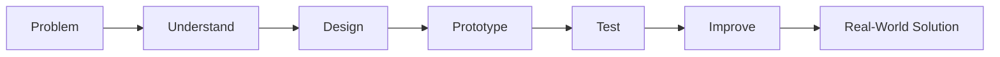
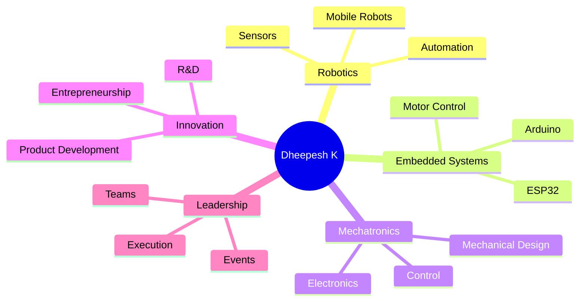

<!-- ========================================================= -->
<!--                    DHEEPESH K - README                    -->
<!-- ========================================================= -->
<div align="center">

</div>
<div align="center">
⚡ Building Machines. Writing Code. Creating Impact.
🚀 B.E. Mechatronics Engineering Student
🤖 Robotics & Embedded Systems Enthusiast
💡 Innovation | Product Development | Research & Entrepreneurship

<br>
<a href="mailto:dheepeshkuppusamy@gmail.com">
  
</a>
<a href="mailto:dheepeshk.25mts@kongu.edu">
  
</a>
<a href="https://www.linkedin.com/in/dheepeshk">
  
</a>
<a href="https://github.com/DheepeshK">
  
</a>
<a href="https://dheepeshk.vercel.app">
  
</a>
</div>
---
🧬 About Me

Hi, I’m Dheepesh K, a B.E. Mechatronics Engineering student at Kongu Engineering College.
I am passionate about building things that combine:
```txt
Mechanical Systems + Electronics + Programming + Design Thinking
```
My interests are centered around Robotics, Embedded Systems, Automation, Product Development, Research & Development, and Entrepreneurship.
I believe engineering becomes powerful when ideas move from notebooks to prototypes, from prototypes to products, and from products to real-world impact.
<br clear="right"/>
---
🎯 My Engineering Identity

<div align="center">
⚙️ I don’t just want to learn engineering.
I want to build with it.
</div>
---
🎓 Education
<table>
<tr>
<td><b>Degree</b></td>
<td>Bachelor of Engineering - B.E.</td>
</tr>
<tr>
<td><b>Branch</b></td>
<td>Mechatronics Engineering</td>
</tr>
<tr>
<td><b>Institution</b></td>
<td>Kongu Engineering College, Autonomous</td>
</tr>
<tr>
<td><b>Expected Graduation</b></td>
<td>2029</td>
</tr>
<tr>
<td><b>CGPA</b></td>
<td><b>8.96 / 10.00</b></td>
</tr>
</table>
---
⚙️ Tech Arsenal
💻 Programming & Technical Computing
<p>


</p>
🔌 Embedded Systems & Electronics
<p>


</p>
🧩 CAD, Design & Productivity
<p>


</p>
🎬 Creative & Media Tools
<p>


</p>
---
🏗️ What I’m Building Myself Into
<div align="center">
Domain	Focus
🤖 Robotics	Mobile robots, automation systems, sensors, control
🔌 Embedded Systems	Arduino, ESP32, sensor interfacing, motor drivers
⚙️ Mechatronics	Mechanical systems + electronics + programming
🧠 R&D	Problem identification, experimentation, prototyping
💡 Entrepreneurship	Product thinking, innovation, startup-oriented learning
🎬 Media + Tech	Event media, editing, livestreaming, technical execution
</div>
---
🏆 Achievements
<div align="center">
Achievement	Result
MATLAB Cody Contest	🥇 First Place
C Programming Contest	🥈 Second Place
</div>
---
📜 Certifications
<div align="center">


</div>
---
👑 Leadership & Responsibility
🔷 Secretary — Science & Humanities Association, Cluster 3
As Secretary, I contributed to student leadership, event coordination, and academic engagement activities.
```txt
Leadership → Coordination → Execution → Teamwork → Impact
```
Coordinated and led six department-level academic and technical events
Assisted in planning, organizing, and executing student engagement activities
Worked with student teams and faculty for smooth event execution
🔷 Other Roles
Executive Member — Technical Team, Self Development Club
Executive Member — Media Team, Institution’s Innovation Council
Volunteer — IDE Bootcamp
Volunteer — EDII-TN Programs
---
🔥 Workshops & Technical Exposure
```txt
Critical Thinking
Design Thinking
Problem Identification
Innovation Mindset
Startup-Oriented Learning
```
2-Day Workshop on Critical & Design Thinking — IEF@KEC
Design Thinking and Problem Identification Workshop — TBI@KEC
---
🎯 Areas of Interest
<div align="center">


</div>
---
🧭 Current Mission

---
🌱 Currently Learning & Exploring
Embedded system design using microcontrollers
Robotics and automation fundamentals
Programming for engineering applications
CAD and mechanical design workflows
Product development and innovation methods
Research-oriented problem solving
Real-world engineering project execution
---
📊 GitHub Analytics
<div align="center">


<br><br>

<br><br>

</div>
---
🧠 My Build Philosophy
<div align="center">
```txt
Observe deeply.
Think clearly.
Design practically.
Build patiently.
Test honestly.
Improve continuously.
```
</div>
> Engineering is not only about knowing concepts.  
> It is about using concepts to create something useful.
---
🌐 Connect With Me
<div align="center">
<a href="mailto:dheepeshkuppusamy@gmail.com">
  
</a>
<a href="mailto:dheepeshk.25mts@kongu.edu">
  
</a>
<a href="https://www.linkedin.com/in/dheepeshk">
  
</a>
<a href="https://github.com/DheepeshK">
  
</a>
<a href="https://dheepeshk.vercel.app">
  
</a>
</div>
---
<div align="center">
⚡ Engineering is where imagination gets a body.

<br><br>

</div>
